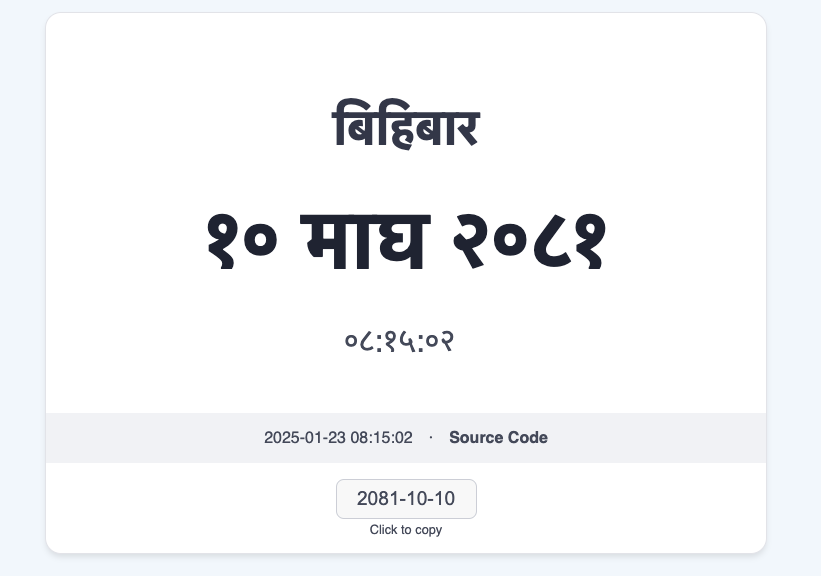

# Today's Nepali Date

This is a simple website that shows today's Nepali date. It is built with HTML, CSS, and JavaScript, with accurate time from the server.

## Demo

You can see this site live at [NepaliDate.org](https://nepalidate.org)

## Bikram Sambat Date

Bikram Sambat is the traditional Nepali calendar. It is based on the Saka era, and is totally different from the popular A.D. date system.

## How to use

1. Open the website in your browser.
2. The date will be shown in the center of the screen.

# How it works

The website uses the server time to show the date. The server time is fetched from the server and is used to show the date. The date conversion done on the client side with JavaScript.

# How it looks like

